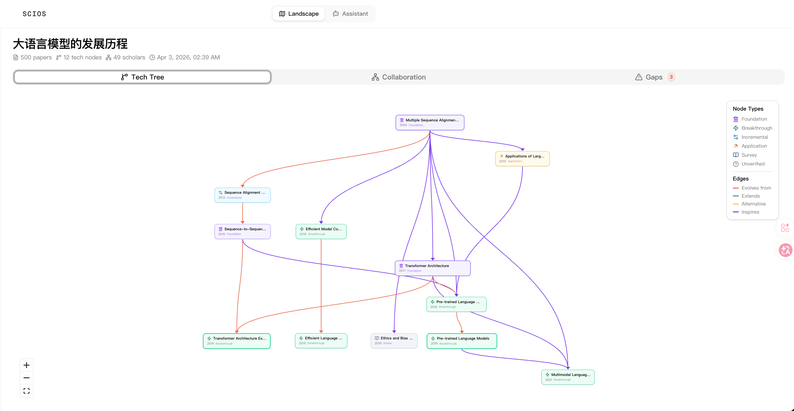
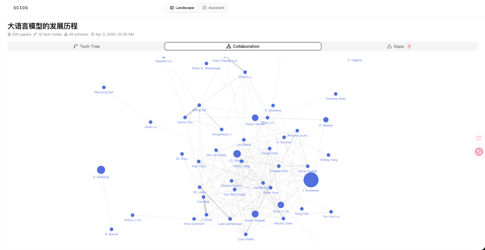
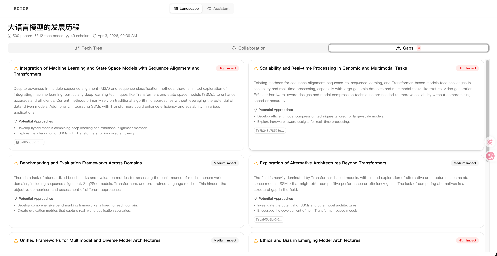
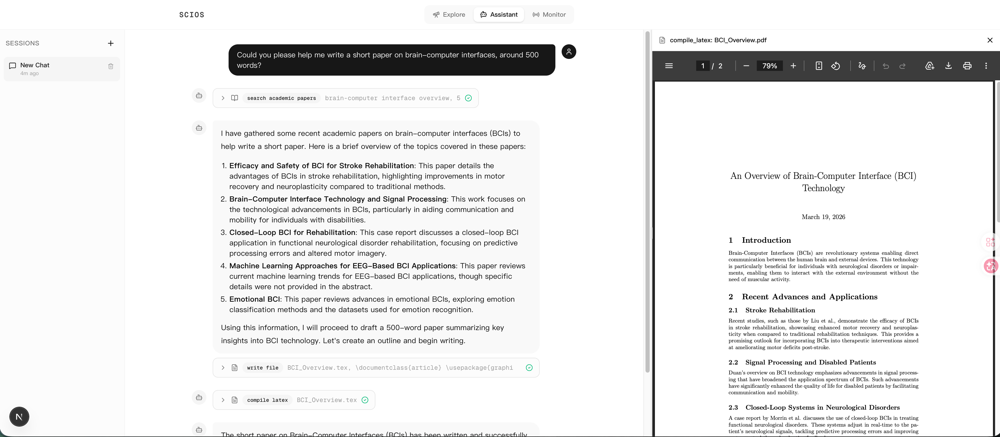

<div align="center">
  <h1>SCIOS</h1>
  <p><strong>Your Own Personal AI Research Assistant</strong></p>
  <p>An intelligent, locally-run academic agent focused on dynamic research landscape analysis and interactive assistant workflows.</p>
</div>

## 🌟 Features

- **Dynamic Research Landscape**
  Build a structured, visual research workspace for a topic through three core modules:
  1) **Tech Tree** (technology evolution paths),
  2) **Collaboration Network** (scholar groups and co-author relationships),
  3) **Research Gaps** (evidence-grounded open problems and opportunities).
  Tasks are managed in a unified left-sidebar workspace.

- **Interactive Academic Assistant**
  A powerful AI agent equipped with a local sandbox workspace. It can help you search for literature, analyze experimental data, and even write and compile LaTeX documents autonomously.

## 📸 Screenshots

### Landscape Workspace
Create and manage landscape tasks in a sidebar, then inspect each task's visual analysis in the main panel.

### Tech Tree
Visualize methodology evolution, key milestones, and branch structures over time.



### Collaboration Network
Inspect active scholars, collaboration strength, and major research groups in the topic.



### Research Gaps
Surface high-value open questions with evidence papers and suggested research directions.



### Assistant Mode
Use the interactive assistant to search papers, edit LaTeX files, and compile PDFs directly in the local workspace.



## 🧰 Built-in Agent Tools

The Interactive Assistant is equipped with a variety of powerful tools to perform complex tasks:

- **Academic Search (`search_academic_papers`)**: Search and retrieve papers from academic sources.
- **Web Search (`web_search`)**: Access the internet via Tavily to find the latest news, tutorials, and general knowledge.
- **Workspace Operations (`read_file`, `write_file`, `edit_file`, `glob_search`)**: Read, create, and precisely edit files within a secure local sandbox.
- **Persistent Shell (`run_bash_command`)**: Execute shell commands, manage files, and install dependencies in a persistent bash session.
- **Python REPL (`run_python_code`)**: Execute Python code for data analysis, plotting, or testing algorithms.
- **LaTeX Compiler (`compile_latex`)**: Automatically compile `.tex` files into PDF documents and fix compilation errors.
- **Data Parser (`parse_csv_log`)**: Quickly extract and analyze metrics from experimental CSV logs.

## 📚 Supported Academic Sources

SCIOS currently uses a focused source strategy:

- **Landscape pipeline**: **Semantic Scholar only** (papers, citations, authors, and scholar profiles)
- **Assistant tools**: **Semantic Scholar + Tavily Web Search** (tool-augmented exploration and web context lookup)

---

## 🚀 Getting Started

SCIOS is split into a Python backend (FastAPI) and a Next.js frontend. Below are the instructions to set up and run the project.

### Prerequisites

- **Python** >= 3.10
- **Node.js** >= 18.x
- **uv** (Recommended Python package manager)
- **pdflatex** (Optional, required only if you want the Assistant to compile LaTeX)

### 1. Backend Setup

```bash
# Navigate to the backend directory
cd backend

# Copy the environment template
cp .env.example .env
```

#### Configuration (`.env`)
You must configure the API keys in your `.env` file for SCIOS to function properly:
- `LLM_API_KEY`: API key for your selected provider.
- `LLM_BASE_URL`: API base URL. Keep the default for OpenAI; set it for OpenAI-compatible providers.
- `LLM_MODEL`: Model name in LiteLLM format.
- `TAVILY_API_KEY`: API key for Tavily Web Search.
- *(Optional)* Keep additional source-related variables for future experimentation. Current core flow uses:
  - Landscape: Semantic Scholar
  - Assistant: Semantic Scholar + Tavily

##### Multi-model provider examples (via LiteLLM)

```bash
# OpenAI
LLM_BASE_URL=https://api.openai.com/v1
LLM_MODEL=gpt-4o
LLM_API_KEY=<OPENAI_API_KEY>

# Anthropic Claude
LLM_BASE_URL=
LLM_MODEL=anthropic/claude-3-5-sonnet-20241022
LLM_API_KEY=<ANTHROPIC_API_KEY>

# Google Gemini
LLM_BASE_URL=
LLM_MODEL=gemini/gemini-1.5-pro
LLM_API_KEY=<GEMINI_API_KEY>

# DeepSeek
LLM_BASE_URL=https://api.deepseek.com/v1
LLM_MODEL=deepseek-chat
LLM_API_KEY=<DEEPSEEK_API_KEY>
```

#### Run the Backend

Instead of using development hot-reloading, run the backend using standard FastAPI commands:

```bash
# Install dependencies
uv sync

# Run the backend server
uv run fastapi run src/main.py --host 0.0.0.0 --port 8000
```
*The backend API will be available at `http://localhost:8000`. API documentation is at `http://localhost:8000/docs`.*

### 2. Frontend Setup

Open a new terminal window to start the Next.js frontend.

```bash
# Navigate to the frontend directory
cd frontend

# Install dependencies
npm install

# Build the project for production
npm run build

# Start the production server
npm run start
```
*The frontend interface will be accessible at `http://localhost:3000`.*

---

## 💡 How to Use

1. **Landscape**: Open `http://localhost:3000`, create a topic task in the left sidebar, and follow real-time task progress. Once completed, inspect tech tree, collaboration graph, and research gaps in the main workspace.
2. **Assistant**: Switch to the Assistant tab for tool-augmented academic workflows. For example: "Search recent papers on graph neural networks, summarize top 3, draft a LaTeX intro, and compile PDF."
