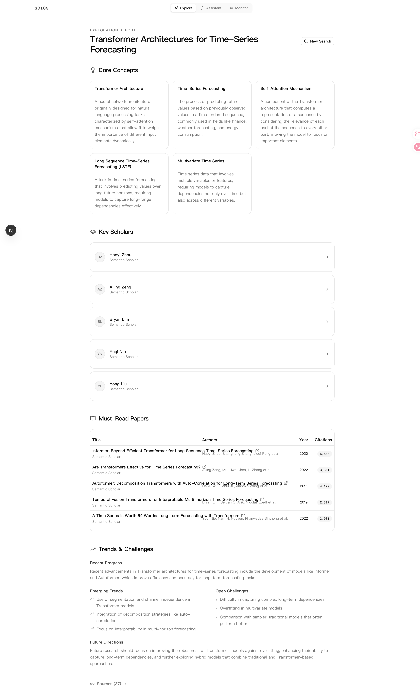
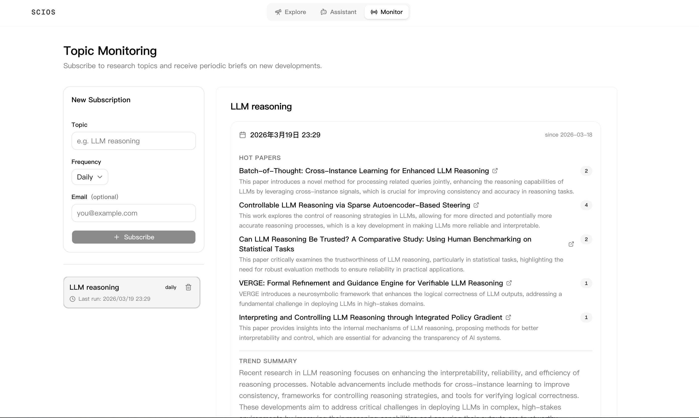

<div align="center">
  <h1>SCIOS</h1>
  <p><strong>Your Own Personal AI Research Assistant</strong></p>
  <p>An intelligent, locally-run academic agent designed to automate literature exploration, continuously monitor research fields, and assist in academic writing and data analysis.</p>
</div>

## 🌟 Features

- **Deep Research (Topic Exploration)**
  Generate professional, concise academic reports for any given topic. SCIOS intelligently routes queries to the most relevant academic databases, retrieves and synthesizes papers, and provides structured insights.
  
- **Field Tracking (Topic Monitoring)**
  Periodically track specific research fields or keywords for new developments. SCIOS runs automated scheduled tasks to fetch the latest papers and delivers summarized daily/weekly briefs directly to your dashboard and email.

- **Interactive Academic Assistant**
  A powerful AI agent equipped with a local sandbox workspace. It can help you search for literature, analyze experimental data, and even write and compile LaTeX documents autonomously.

## 📸 Screenshots

### Explore Mode
Generate structured topic exploration reports with core concepts, key scholars, must-read papers, and trend analysis.



### Assistant Mode
Use the interactive assistant to search papers, edit LaTeX files, and compile PDFs directly in the local workspace.


### Monitor Mode
Subscribe to topics and receive periodic research briefs with newly published papers and concise summaries.



## 🧰 Built-in Agent Tools

The Interactive Assistant is equipped with a variety of powerful tools to perform complex tasks:

- **Academic Search (`search_academic_papers`)**: Search for papers across multiple academic databases.
- **Web Search (`web_search`)**: Access the internet via Tavily to find the latest news, tutorials, and general knowledge.
- **Workspace Operations (`read_file`, `write_file`, `edit_file`, `glob_search`)**: Read, create, and precisely edit files within a secure local sandbox.
- **Persistent Shell (`run_bash_command`)**: Execute shell commands, manage files, and install dependencies in a persistent bash session.
- **Python REPL (`run_python_code`)**: Execute Python code for data analysis, plotting, or testing algorithms.
- **LaTeX Compiler (`compile_latex`)**: Automatically compile `.tex` files into PDF documents and fix compilation errors.
- **Data Parser (`parse_csv_log`)**: Quickly extract and analyze metrics from experimental CSV logs.

## 📚 Supported Academic Sources

SCIOS integrates a hybrid intelligent routing mechanism to query the most appropriate sources for your topic. Supported sources include:

- **ArXiv** (Computer Science, Physics, Math)
- **PubMed & PMC & EuropePMC** (Biomedical, Life Sciences)
- **bioRxiv & medRxiv** (Biology and Medicine Preprints)
- **Semantic Scholar** (General academic graph)
- **Crossref & OpenAlex** (Broad scholarly metadata)
- **CORE** (Open access research papers)
- **dblp** (Computer Science bibliography)
- **DOAJ** (Directory of Open Access Journals)

---

## 🚀 Getting Started

SCIOS is split into a Python backend (FastAPI) and a Next.js frontend. Below are the instructions to set up and run the project.

### Prerequisites

- **Python** >= 3.10
- **Node.js** >= 18.x
- **uv** (Recommended Python package manager)
- **pdflatex** (Optional, required only if you want the Assistant to compile LaTeX)

### 1. Backend Setup

```bash
# Navigate to the backend directory
cd backend

# Copy the environment template
cp .env.example .env
```

#### Configuration (`.env`)
You must configure the API keys in your `.env` file for SCIOS to function properly:
- `LLM_API_KEY`: API key for your selected provider.
- `LLM_BASE_URL`: API base URL. Keep the default for OpenAI; set it for OpenAI-compatible providers.
- `LLM_MODEL`: Model name in LiteLLM format.
- `TAVILY_API_KEY`: API key for Tavily Web Search.
- *(Optional)* Add other specific source keys like `CORE_API_KEY`, `DOAJ_API_KEY`, or your email for Unpaywall/Crossref to enhance search stability.
- *(Optional)* Configure `SMTP_*` variables if you want to receive monitoring reports via email.

##### Multi-model provider examples (via LiteLLM)

```bash
# OpenAI
LLM_BASE_URL=https://api.openai.com/v1
LLM_MODEL=gpt-4o
LLM_API_KEY=<OPENAI_API_KEY>

# Anthropic Claude
LLM_BASE_URL=
LLM_MODEL=anthropic/claude-3-5-sonnet-20241022
LLM_API_KEY=<ANTHROPIC_API_KEY>

# Google Gemini
LLM_BASE_URL=
LLM_MODEL=gemini/gemini-1.5-pro
LLM_API_KEY=<GEMINI_API_KEY>

# DeepSeek
LLM_BASE_URL=https://api.deepseek.com/v1
LLM_MODEL=deepseek-chat
LLM_API_KEY=<DEEPSEEK_API_KEY>
```

#### Run the Backend

Instead of using development hot-reloading, run the backend using standard FastAPI commands:

```bash
# Install dependencies
uv sync

# Run the backend server
uv run fastapi run src/main.py --host 0.0.0.0 --port 8000
```
*The backend API will be available at `http://localhost:8000`. API documentation is at `http://localhost:8000/docs`.*

### 2. Frontend Setup

Open a new terminal window to start the Next.js frontend.

```bash
# Navigate to the frontend directory
cd frontend

# Install dependencies
npm install

# Build the project for production
npm run build

# Start the production server
npm run start
```
*The frontend interface will be accessible at `http://localhost:3000`.*

---

## 💡 How to Use

1. **Deep Research**: Open `http://localhost:3000`, enter a complex academic query (e.g., "Reinforcement Learning from Human Feedback in LLMs"), and let the agent retrieve, synthesize, and format a comprehensive report for you.
2. **Monitoring**: Navigate to the "Monitor" tab, add a research field, and SCIOS will automatically track and compile daily/weekly literature briefs.
3. **Assistant**: Engage with the Interactive Assistant. Ask it to "Search for the latest papers on graph neural networks, summarize the top 3, write a brief LaTeX introduction about them, and compile it to PDF." Watch it plan, execute tools, and fix errors autonomously in the workspace.
